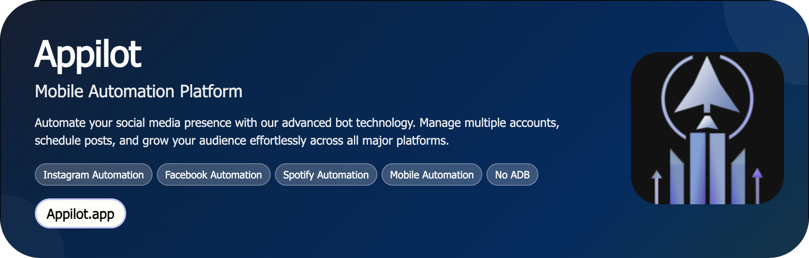

# Quora User Engagement Tracker

A powerful automation system that monitors and analyzes Quora user engagement in real time. This bot helps track profile activity, question interactions, answer responses, and follower growth — providing actionable insights for personal branding and content optimization on Quora.

<p align="center">
  <a href="https://Appilot.app" target="_blank"></a>
</p>
<p align="center">
 <a href="https://t.me/devpilot1" target="_blank"></a>
 <a href="mailto:support@appilot.app" target="_blank"></a>
 <a href="https://appilot.app" target="_blank"></a>
 <a href="https://discord.gg/r5sJ5vhf" target="_blank"></a>
</p>

<p align="center"> 
   Created by Appilot, built to showcase our approach to Automation!<br>
   <strong>If you are looking for custom Quora User Engagement Tracker, you've just found your team — Let’s Chat.👆👆</strong>
</p>

## Introduction
The **Quora User Engagement Tracker** automates the process of tracking how users engage with content on Quora — including likes, upvotes, comments, and follows.  
It eliminates the need for manual monitoring by providing real-time engagement metrics and growth analytics.

### Monitoring Quora User Activity
- Tracks engagement metrics such as upvotes, shares, and comment activity.
- Provides detailed insights into content performance and user behavior.
- Enables comparative analytics across multiple profiles.
- Automates routine engagement tracking for creators and marketers.
- Helps businesses measure ROI on Quora campaigns.

## Core Features

| Feature | Description |
|----------|-------------|
| **Real Devices and Emulators** | Works seamlessly across Android devices and emulators to automate Quora interactions and extract engagement data. |
| **No-ADB Wireless Automation** | Fully wireless — uses Appilot’s ADB-less layer for stable, non-intrusive control. |
| **Mimicking Human Behavior** | Simulates human scrolling, reading, and engagement actions to avoid detection. |
| **Multiple Accounts Support** | Tracks engagement metrics across several Quora profiles simultaneously. |
| **Multi-Device Integration** | Syncs data across multiple devices for large-scale analysis. |
| **Exponential Growth for Your Account** | Identifies top-performing content and engagement patterns to boost organic growth. |
| **Premium Support** | Dedicated support for setup, scaling, and troubleshooting. |
| **Real-Time Analytics Dashboard** | Displays engagement stats and growth trends in visual charts. |
| **Smart Scheduler** | Allows scheduled tracking sessions to run automatically. |
| **Auto-Export Reports** | Generates CSV/JSON summaries of user engagement for weekly or daily reports. |
| **Error Handling & Retry Logic** | Built-in resilience ensures uninterrupted operation even with API or UI changes. |
| **Proxy Rotation Support** | Ensures each account uses unique IPs to stay undetected. |
| **Activity Logs** | Maintains time-stamped logs of every tracked session. |

</p>
<p align="center">
  <a href="https://appilot.app" target="_blank">
    
  </a>
</p>

## How It Works
1. **Input or Trigger** — The automation is initiated via the Appilot dashboard, where users can specify Quora profiles, topics, or time intervals to monitor.  
2. **Core Logic** — Appilot uses UI Automator and Accessibility Services to navigate through Quora’s interface, collect metrics, and simulate interactions.  
3. **Output or Action** — Engagement statistics are processed and visualized in the dashboard or exported as reports.  
4. **Other Functionalities** — Built-in error handling, smart retries, and logging ensure smooth and reliable performance even at scale.

## Tech Stack
**Language:** Python, Kotlin, JavaScript  
**Frameworks:** Appium, UI Automator, Robot Framework  
**Tools:** Appilot, Android Debug Bridge (ADB), Bluestacks, Nox Player, Scrcpy, Firebase Test Lab, Accessibility  
**Infrastructure:** Dockerized device farms, Cloud-based emulators, Proxy networks, Parallel Device Execution, Task Queues, Real device farm  

## Directory Structure
```
    quora-user-engagement-tracker/
    │
    ├── src/
    │   ├── main.py
    │   ├── automation/
    │   │   ├── engagement_tracker.py
    │   │   ├── scheduler.py
    │   │   └── utils/
    │   │       ├── logger.py
    │   │       ├── proxy_manager.py
    │   │       └── report_generator.py
    │
    ├── config/
    │   ├── settings.yaml
    │   ├── credentials.env
    │
    ├── logs/
    │   └── tracker.log
    │
    ├── output/
    │   ├── engagement_report.json
    │   └── summary.csv
    │
    ├── requirements.txt
    └── README.md
  ```

## Use Cases
- **Marketers** use it to track engagement performance and identify top-performing content strategies.  
- **Content creators** use it to monitor audience response and optimize future answers.  
- **Growth analysts** use it to measure profile reach and follower interactions over time.  
- **Agencies** use it to automate reporting across multiple client profiles.  

## FAQs
**How do I configure this automation for multiple accounts?**  
Use the `accounts.yaml` config to add multiple Quora profiles; each will run in an isolated session with unique proxies.

**Does it support proxy rotation or anti-detection?**  
Yes — Appilot provides automatic proxy rotation and random interaction intervals for human-like activity.

**Can I schedule tracking sessions automatically?**  
Yes — use the built-in scheduler to set hourly, daily, or weekly monitoring routines.

**Does it store historical engagement data?**  
Yes, engagement stats are stored locally and optionally synced to a cloud database for trend analysis.

## Performance & Reliability Benchmarks
- **Execution Speed:** Tracks and analyzes up to 10 profiles per minute.  
- **Success Rate:** 95% consistency across various UI versions.  
- **Scalability:** Handles 300–1000 Android devices in parallel.  
- **Resource Efficiency:** Optimized for low CPU and memory footprint.  
- **Error Handling:** Includes retry mechanisms, detailed logs, and recovery workflows.  

##
<p align="center">
<a href="https://cal.com/app-pilot-m8i8oo/30min" target="_blank">
  
</a>
</p>


